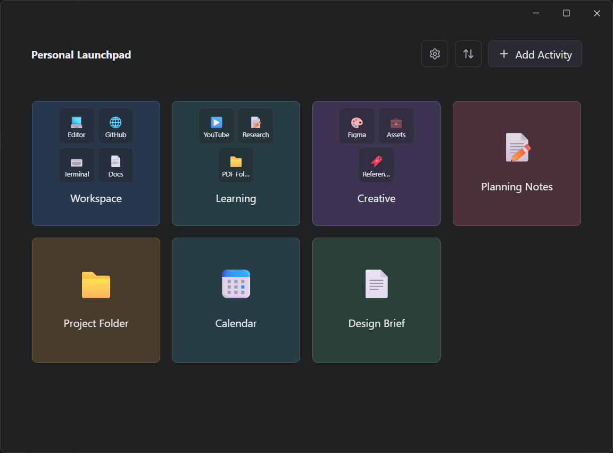

# Hey, I'm Martin 👋

I'm a Computer Science graduate from the American University of Beirut (AUB) and an incoming MSc Applied Machine Learning student at Imperial College London.

I enjoy building practical software that either teaches me something new, solves a problem I actually have, or ideally both. My projects range from machine learning research to desktop applications, but they all share the same goal: creating polished software I'd genuinely use myself.

---

# 🚀 Currently Building

## Personal Launchpad

*A Windows productivity launcher built around **activities** instead of simply launching applications.*

<a href="https://github.com/MartinMans/personal-launchpad"><strong>Repository</strong></a>

### Highlights

* Launch applications, files, folders and websites
* Organize activities into reusable bundles
* Restore complete desktop layouts
* Lightweight and local-first
* Designed to improve everyday workflows

---

# 🧩 Featured Projects

### 🧠 [Brain Tumor Classification](https://github.com/MartinMans/brain_tumor_classification)

Binary brain MRI classification using MobileNetV2 and TensorFlow.

*Computer Vision · Medical Imaging · Transfer Learning*

---

### 🔬 Linear Kernel Research

Research project exploring linear kernel methods for text classification under constrained settings.

*Natural Language Processing · Machine Learning*

---

### 📊 [Audit Standardizer](https://github.com/MartinMans/audit_standardizer)

Proof-of-concept application for standardizing procurement audit data into a unified data model and automating audit checks.

---

### 🔈 [BlanketPlusPlus](https://github.com/MartinMans/BlanketPlusPlus)

Ambient sound mixer for Windows featuring presets, tray controls, and custom audio imports.

---

### 🍎 [Apple Health Parser](https://github.com/MartinMans/apple_health_parser)

Python application for parsing and analyzing Apple Health exports.

---

### 💰 [Expense Tracker](https://github.com/MartinMans/expense-tracker)

Desktop budgeting application built to simplify personal expense tracking.

---

# 🌱 Currently

* Building and maintaining Personal Launchpad
* Conducting machine learning research in NLP
* Preparing for my MSc in Applied Machine Learning
* Exploring practical applications of AI in software engineering

---

# 🤝 Connect

If anything here interests you, feel free to reach out.

